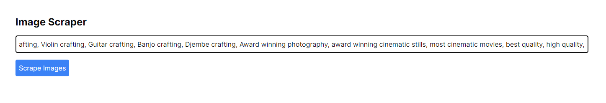

## Yandex Image Scraper

## Getting Started

Git pull this repository, then run the following commands:

First, install dependencies:

```bash
npm install
```

Second, run the development server:

```bash
npm run dev
```

Open [http://localhost:3000](http://localhost:3000) with your browser to see the result.

Add a list of things to scrape as per the image below with comma separated values (add ',' in between each search term), and click "Scrape Images".


You can track progress in the terminal where you first ran `npm run dev` as well as the scrape_log.txt in the root folder.

To see your images go to the public folder > images > and click on the folder with the search term you entered.
"# yandex-scraper" 
